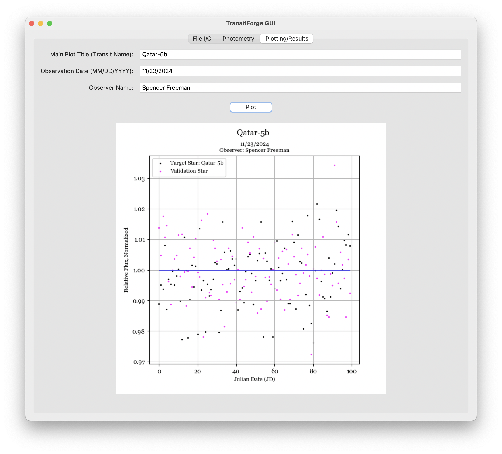
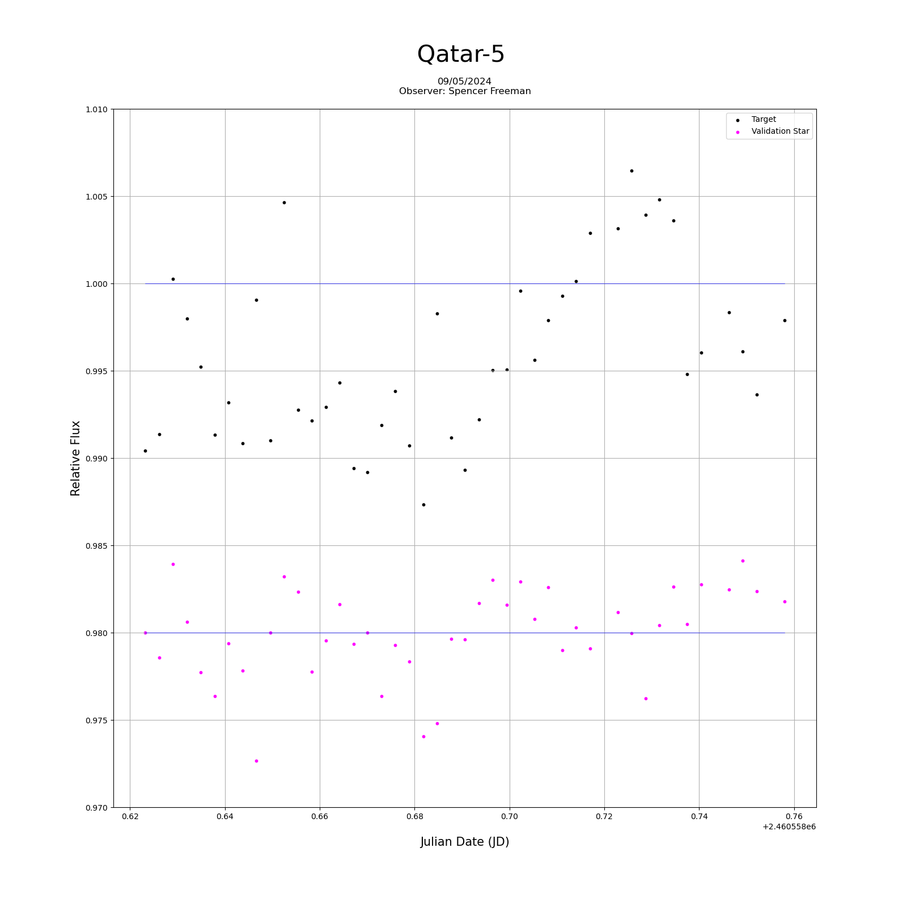

# TransitForge (STEPUP Image Analysis Pipeline - V3)

  
  
  

## Pipeline Overview
#### An image pipeline for the calibration and processing of FITS images, equipped with differential photometric techniques. Dependencies include Numpy/Matplotlib, Astropy/Photutils, and Pandas (details in requirements.txt).

- Primary Goal: Production of exoplanet transit light curves.
- Development: Ongoing work on a graphical user interface (GUI) and existing features, decrease overhead computation.
- Target Data: The pipeline aims to support analysis of existing TESS data with libraries such as Astropy, the Photutils sub-package, and personal/group observational data.
- Functionality: Designed to work similarly to AstroImageJ, but in a more condensed and streamlined manner.
  
## GUI Preview

  

  

  

## Data and Output
#### Median of flat and bias frames are computed and mapped to a color plot as shown below:

  

#### Comparison of uncalibrated and calibrated images (AstroImageJ window):

  

#### Current Adjustments: These remove some background noise, apply lens/CCD corrections, reduce vignetting, and mitigate haze.

 
    

